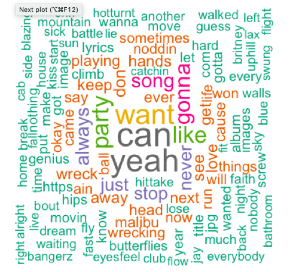
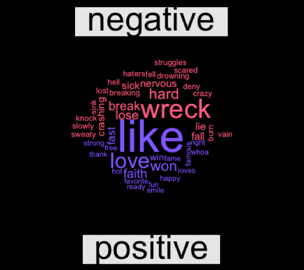
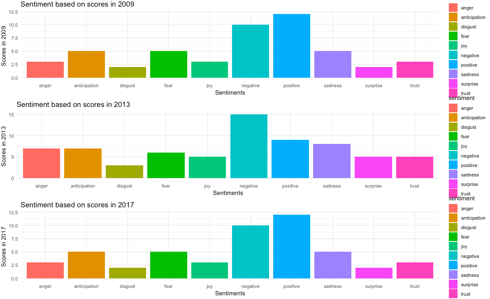
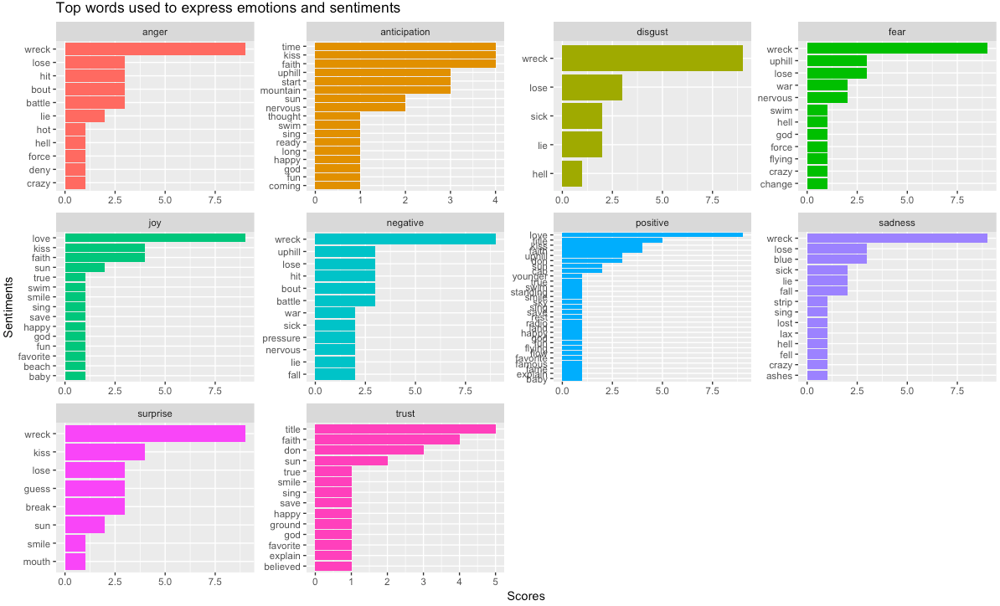

# NLP_SongLyrics
An extensive analysis of few of the Miley Cyrus songs using Natural Language Processing (NLP) on the lyrics, to uncover the underlying emotions and sentiments and to look for changes in emotions with change in circumstances

The Genius.com API allowed me to download the lyrics. In total I have downloaded 5 most famous tracks in regular interval of time as my main focus was to see how change in life circumstances(life events) change her music over the years. 
The Songs are:
1. The Climb (yr 2009)
2. Party in The U.S.A. (yr 2009)
3. We Can't Stop (Yr 2013)
4. Wrecking Ball (Yr 2013)
5. Malibu (Yr 2017)

The aim is to do text mining techniques, specifically Natural Language Processing (NLP) on the lyrics to uncover the underlying emotions and sentiments. 

# Word Coud
I created wordcloud to get the gist of word frequency from the above mentioned songs
Most Frequent words used by her are:

# Positive and Negative words in the song

I have used bing tool of syuzhet package. Bing method gives or better yet segregates the words into positive and negative.

Some of Positive words are - Like, Love, faith , won

Some of Negative words are - Wreck, hard, break, lose, sick

# Sentiments expressed and changed over the years

The chart given below shows the emotions for the year 2009, 2013, 2017. 
We see that ‘anticipation’, 'fear' and ‘sadness’ are the top three emotions.
Major changes have come in
We can estimate from the this chart that some major changes have come into her life in the period, 2010 - 2012. In 2013, emotion 'trust' , 'disgust', 'joy' rised. We can see the significant insrease in emtion 'sadness', 'surprise', 'anger', 'negative' and significant decrease in 'positive' emotion. We can assume that all her emotions become extreme in year 2013.

# Top words used to describe different emotions
The figure given below finds out the most frequently used words that are associated with the emotions spanning across all the five songs. 

